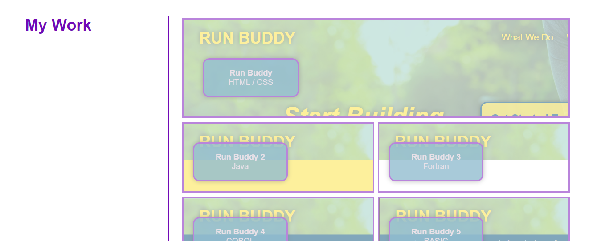
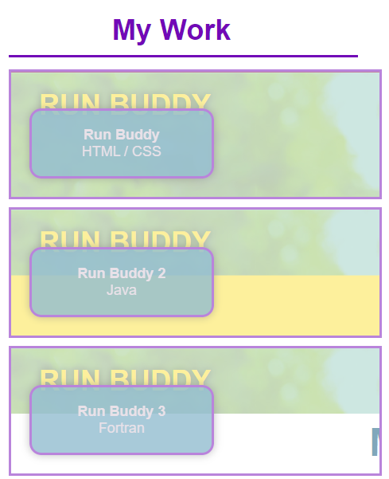

## Portfolio
The purpose of this is to showcase the various projects I have created and the variety of programming languages I am familiar with.  This is a living document, and as such is currently incomplete.  The live link for this project can be found on [my Github](https://zk229.github.io/portfolio/).

Placeholder links are currently dummied out but will be implemented as my portfolio expands.

## Overview
Here is a current list of what can be found on this portfolio:
- [Coding Quiz](https://zk229.github.io/code-quiz/), a website featuring a multiple choice quiz to practice basic coding knowledge
- [Weather Dashboard](https://zk229.github.io/weather-dashboard/), a website that uses the Open Weather API to create and display weather forecasts for a given city
- [COVID EXPosure](https://zk229.github.io/covid-exposure/), a website that allows user to track COVID data from the CDC by county in the state of Florida

## Screenshots (WIP)
Desktop Version:

Mobile Version:

